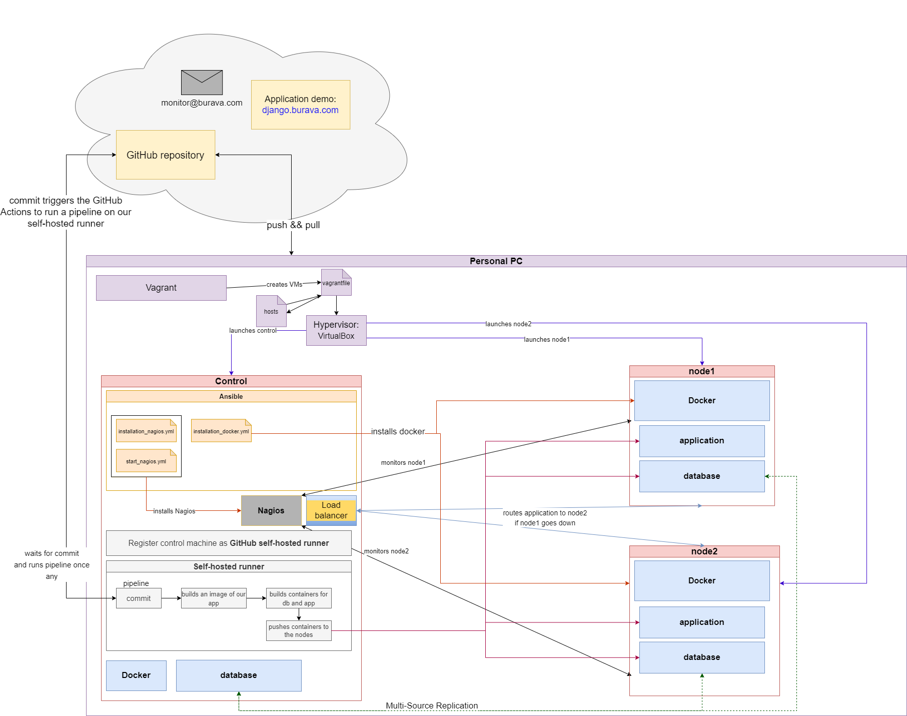

# Django application with DevOps practices #
Danylo Hotvianskyi entry-level portfolio project. Stack: Django, Docker, Ansible, Vagrant, Nagios, GitHub actions.

**Project is not finished. In progress...**

## Description of the project: ##
The idea of this project is to visualize the DevOps practices deploying the Django simple application using 3 different servers.

### Application ###
[Application](vagrant/djangoapp/README.md) in the project is the Django To Do list application with the MariaDB database. The project idea is not about the application itself, it is just used as an example. 

Application on-line demo: [django.burava.com](https://django.burava.com)
# OUTDATED #
### Project Diagram ###

### Plan: ###
* [Vagrant](vagrant/README.md) is used to launch 3 VM servers in VirtualBox:
  * *control* server is used to operate the other two servers. On this server, we will install Ansible and Nagios to monitor our project application.
  * node1 is used to deploy our application. 
  * node2 will be a full copy of the first one to ensure High Availability.

This step above is done to imagine that we have 3 different physical servers in our company which all are completely empty and no services are installed on them. And yes, there is no actual sense in this step if you are going to manage your servers from your personal PC. Consider this step as *Creating a lab*.
* [Ansible](vagrant/ansible/README.md) is installed on the *control* server. Playbooks will install and configure **Nagios** on the *control* server, and install **Docker&Docker-compose** on the other two servers.
* [Docker](vagrant/djangoapp/README.md) is used to deploy our application and database as two different containers on our both servers.
* **GitHub Actions** will be used to represent the *CI/CD* practices to automatically build, test, and deploy the application whenever changes are made to the repository. We will register our *control* server as the **GitHub self-hosted runner** to make it listen to our repository and once there is a new commit on it, it will trigger the pipeline on the *control* server. 
 
This pipeline will build an image of our application and push it to the *GitHub Registry*, then it will build containers which will be pushed and deployed to our nodes. 
* **Nagios** will be used to monitor both servers' performance. Also, it will monitor our application demo and notify us when there is any issue.
* It is planned that the **HAProxy Load balancer** will be used to route the application traffic to node2 if node1 is down for some reason.
* To ensure the *database synchronization* between node1 and node2, it is planned to configure the *Multi-Source Replication* system using the built-in MariaDB configuration between the databases through the mirror database on the control server or directly between node1 and node2 (I have not decided yet).
